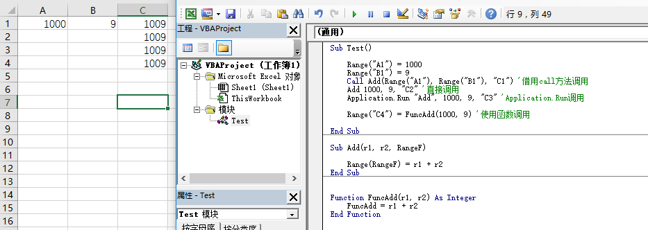
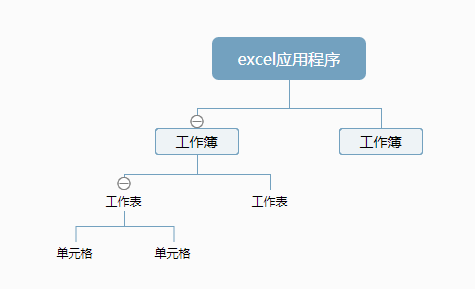
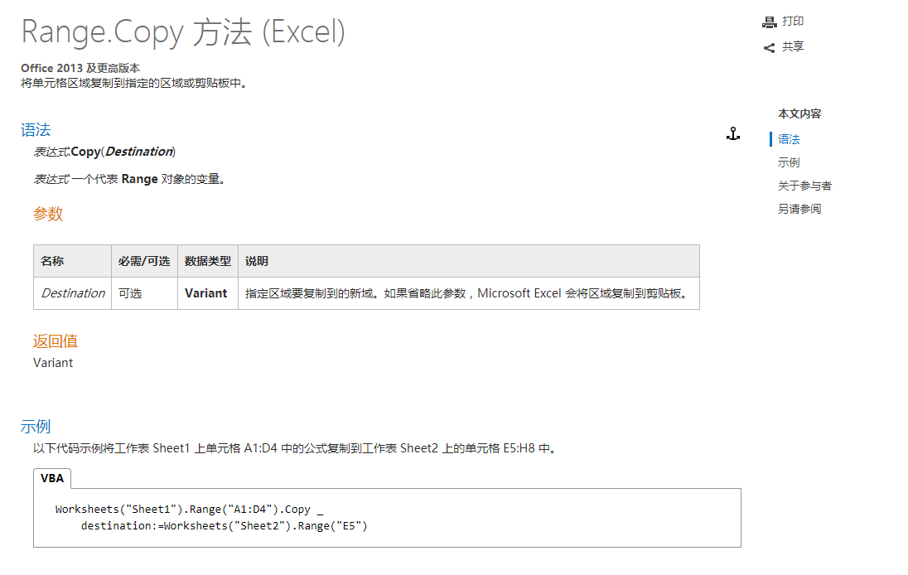

# 简明Excel VBA:whale:

## TODO
- [x] 提纲
- [x] 文档列表
- [x] 语法说明
- [ ] 对象操作说明
- [ ] 参考资料
- [ ] 若雨化

[TOC]

## 0x00 文档列表
- [Excel VBA 参考,官方文档,适用2013及以上](https://msdn.microsoft.com/zh-cn/library/ee861528.aspx)
- [Excel宏教程 (宏的介绍与基本使用)](http://blog.csdn.net/lyhdream/article/details/9060801)
- [Excel2010中的VBA入门,官方文档](https://msdn.microsoft.com/zh-cn/library/office/ee814737(v=office.14).aspx)
- [Excel VBA的一些书籍资源,百度网盘](https://pan.baidu.com/s/1i5QSIX3)
- [Excel 函数速查手册](https://support.office.com/zh-cn/article/Excel-%E5%87%BD%E6%95%B0%EF%BC%88%E6%8C%89%E7%B1%BB%E5%88%AB%E5%88%97%E5%87%BA%EF%BC%89-5f91f4e9-7b42-46d2-9bd1-63f26a86c0eb?ui=zh-CN&rs=zh-CN&ad=CN) 
- [VBA的一些使用心得](http://www.cnblogs.com/techyc/p/3355054.html)
- [VBA函数参考](https://msdn.microsoft.com/zh-cn/library/office/jj692811.aspx)

## 0x01 语法说明

都知道学会了英语语法，再加上大量的词汇基础，就算基本掌握了英语了。类似的要使用vba，也要入乡随俗，了解他的构成，简单的说vba包含`数据类型`、`变量&常量`、`对象`和常用的`语句结构`。

不过呢在量和复杂度上远低于英语，不用那么痛苦的记单词了，所以vba其实很简单的。熟悉了规则之后剩下就是查官方函数啦，查Excel提供的可操作对象啦。

顺带一提的是，函数其实也很容易理解，方便使用。拿到一个函数，例如`sum`，只要知道它是求多个数的和就够了，剩下的就是用了。例如`sum(10,9)`结果就是`10`了。函数的一大好处就是隐藏具体实现细节，提供简洁的使用方法。


### 1.1 数据和数据类型

Excel里的每一个单元格都是一个`数据`，无论是数字、字母或标点都是数据。对数据排排队，吃果果，对不同的数据扔到不同的篮子里归类，篮子就是`数据类型`了。

在Excele里面吧，`数据类型`只有`数值`、`文本`、`日期`、`逻辑`或`错误`五种类型。前四种就是最常用的了。数据范围呢也不记，知道多大的数用啥类型就足够了。


| 类型 | 类型名称 | 范围 | 占用空间|声明符号 | 备注|
|--------|-------|-----|--------|-----|----|
| **逻辑型**|
| 布尔 | Boolean|逻辑值True或False|2|
|**数值型**|
|字节| Byte | 0~255的整数|1|
|整数| Integer| -32768~32767|2|%|
|长整数|Long|-2147483648~2147483647|4|&|
|单精度浮点|Single||4|!|
|双精度浮点|Double||4|#|
|货币|Currency||8|@|
|小数|Decimal||14|
|**日期型**|
|日期|Date|日期范围:100/1/1~9999/12/31|8|
|**文本型**|
|变长字符串|String|0~20亿||$|
|定长字符串|String|1~65400||
|**其他**|
|变体型|Variant(数值)|保存任意数值，也可以存储Error,Empty,Nothing,Null等特殊数值|
|对象|Object|引用对象|4|

表1.1 VBA数据类型

补充一点是，数组就像一筐水果，里面可以存不止一个数据。他不是一个具体的数据类型，叫数据结构更合适些。

### 1.2 常量和变量

定义后不能被改变的量，就是`常量`；相反的`变量`就能修改具体值。

在vba里，使用一个`变量`/`常量`要先声明。

`常量`声明方法如下:
`Const 常量名称 As 数据类型 = 存储在常量中的数据`
例如:
```vba
Const PI As Single = 3.14 '定义一个浮点常量为PI,值为3.14
```

`变量`声明方法如下：

`Dim 变量名 As 数据类型`

变量名，必须字母或汉字开头，不能包含空格、句号、感叹号等。

数据类型，对应上面👆表1.1里的那些

更多的声明方法，跟`Dim`声明的区别是作用范围不同：
```vba
Private v1 As Integer   'v1为私有整形变量
Public v2 As String  'v2为共有字符串变量
Static v3 As Integer  'v3为静态变量,程序结束后值不变

'变量声明之后，就可以赋值和使用了
v1 = 1009
v2 = "1009"
v3 = 1009

'使用类型声明符，可以达到跟上面同样的效果
public v2$  '与 Public v2 As String 效果一样

'声明变量时，不指定具体的类型就变成了Variant类型，根据需要转换数据类型
Dim v4
```

使用数组和对象时，也要声明，这里说下数组的声明
```vba
'确定范围的数组，可以存储b-a+1个数，a、b为整数
Dim 数组名称(a To b) As 数据类型

Dim arr(1 TO 100) As Integer '表示arr可以存储100个整数
arr(100) '表示arr中第100个数据

'不指定a，直接声明时，默认a为0
Dim arr2(100) As Integer '表示arr可以存储101个整数,从0数
arr2(100) '表示arr2中第101个数据

'多维数组
Dim arr3(1 To 3,1 To 3,1 To 3) As Integer '定义了一个三维数组，可以存储3*3*3=27个整数

'动态数组，不确定数组大小时使用
Dim arr4() As Integer '定义arr4为整形动态数组
ReDim arr4(1 To v1)  '设定arr4的大小，不能重新设定arr4的类型

```

除了用`Dim`做常规的数组的声明，还有下面这些声明数组的方式:
```vba
'使用Array函数将已知的数据常量放到数组里
Dim arr As Variant        '定义arr为变体类型
arr = Array(1,1,2,3,5,8,13,21) '将整数存储到arr中,索引默认从0开始

'使用Split函数分隔字符串创建数组
Dim arr2 As Variant
arr2 = Split("hello,world",",") '按,分隔字符串 hello,world 并赋值给arr2

'使用Excel单元格区域创建数组
'这种方式创建的数组，索引默认从1开始
Dim arr3 As Variant
arr3 = Range("A1:C3").Value   '将A1:C3中的数组存储到arr3中
Range("A4:C6").Value= arr3    '将arr3中的数据写入到A4:C6中的区域

```

//TODO 补充操作excel赋值的动图

**数组常用的函数**

|函数|函数说明|参数说明|示例|
|----|----|----|----|
|`UBound(Array arr,[Integer i])`|数组最大的索引值|`arr`:数组;`i`:整形,数组维数|
|`LBound(Array arr,[Integer i])`|数组最小的索引值|同上|
|`Join(Array arr,[String s])`|合并字符串|`arr`:数组;`s`:合并的分隔符|
|`Split(String str,[String s])`|分割字符串|`str`:待分割的字符串;`s`:分割字符串的分隔符|

> 函数说明
>
> UBound(Array arr,[Integer i]);
> UBound为函数名
> arr和i为UBound的的参数，用中括号括起来的表示i为非必填参数
> arr和i之前的Array,Integer表示对应参数的数据类型
> 
> 补充
> [VBA 内置函数列表](https://msdn.microsoft.com/zh-cn/library/office/jj692811.aspx)

### 1.3 运算符

运算符的作用是对数据进行操作，像加减乘除等。这块不再具体说明，列一下vba中常用的运算符。

|运算符|作用|示例|
|----|----|----|
|**算术运算符**|
|+|求两个数的和|
|-|求两个数的差|
|*|求两个数的乘积|
|/|求两个数的商|
|`\`|求两个数相除后所得商的整数|
|^|求一个数的某次方|
|Mod|求两个数相除后所得的余数| 10 Mod 9=3|
|**比较运算符**|
|=|比较两个数据是否相等|相等返回 True;否则返回False|
|<>|不相等|
|<|小于|
|>|大于|
|<=|不大于|
|>=|不小于|
|Is|比较连个对象的引用关系|
|Like|比较两个字符串是否匹配| String1 Like String2|
|**文本运算符**|
|+|连接两个字符串|
|&|连接两个字符串|
|**逻辑运算符**|
|And|逻辑与|
|Or|逻辑或|
|Not|逻辑非|
|Xor|逻辑抑或|`表达式1 Xor 表达式2`两个表达式返回的值不相等时为True|
|Eqv|逻辑等价|`表达式1 Eqv 表达式2`两个表达式返回的值相等时为True|
|Imp|逻辑蕴含|

```vba
'Like是个比较有用的运算符，常用来做匹配或模糊匹配。
'在模糊匹配的时候，有一些通配符能方便模糊匹配规则的书写
"这是一个demo1" Like "*demo1" = True '*号表示匹配任意多个字符
"这是一个demo2" Like "????demo2" = True '?号表示匹配任意单个字符
"这是一个demo3" Like "*demo#" = True '#号表示匹配任意数字
```

### 1.4 语句结构

程序通常都是顺序依次执行的。语句结构用来控制程序执行的步骤，一般有`选择`语句、`循环`语句。

**选择**
`选择`用来判断程序执行那一部分代码
```vba
'If...Then...End If
'If选择可以嵌套使用
'常用的三种形式
'普通模式
If 10>3 Then
  操作1'执行这一步
End If

'增加Else
If 1>2 Then
  操作1
Else
  操作2'执行这一步
End If

'嵌套If
If 10>3 Then
  If 1>2 Then
    操作1
  Else
    操作2'执行这一步
  End If
Else
  操作3
End If

'Select...Case..多选一
Dim Length As Integer
Length=10
Select Length
  Case Is >=8
    操作1 '执行这一步
  Case Is >20
    操作2
  Case Else
    操作3
End Select
```

**循环**
`循环`用来让程序重复执行某段代码
```vba
'For...Next循环
'For 循环变量 = 初始值 To 终值 Step 步长
Dim i As Integer
For i = 1 To 10 Step 2 '设定i从1到10，每次增加2，总共执行5次
  操作1   '可以通过设定 Exit For 退出循环
Next i

'For Each..循环，又称遍历
'For Each 变量 In 集合或数组 
Dim arr
Dim i As Integer
arr = Array(1,2,3,4,5)
For Each i In arr '定义变量i，遍历arr数组
  操作1
Next i

'Do..While循环
'Do While 表达式   表达式为假时跳出循环
Dim i As Integer
i=1
Do While i<5  '循环5次
  i=i+1
Loop

'将判断条件后置的Do..While
Dim i As Integer
i=1
Do
  i=i+1
Loop While i<5 '循环4次

'Do Until 直到..循环
'Do Until 表达式    表达式为真时跳出循环
Dim i As Integer
i=5
Do Util i<1  
  i=i-1
Loop

'后置的Do Until
Dim i As Integer
i=5
Do 
  i=i-1
Loop Util i<1  
```

`选择`和`循环`提供了多种实现同一目的的语句结构，他们都能实现同样的作用，差别一般是初始条件。还有书写的复杂度。正确的选择要使用的语句结构，代码逻辑上会更清楚，方便人的阅读。

**简写**

在操作对象的属性时常常要先把对象调用路径都写出来，用`with`可以简化这一操作
```vba
'简化前
WorkSheets("表1").Range("A1").Font.Name="仿宋"
WorkSheets("表1").Range("A1").Font.Size=12
WorkSheets("表1").Range("A1").Font.ColorIndex=3

'使用with
With WorkSheets("表1").Range("A1").Font
        .Name = "仿宋"
	.Size = 12
	.ColorIndex =3
End With
```

### 1.5 过程和函数

`Sub`和`Function`是VBA提供的两种封装体，利用宏录制器得到的就是`Sub`。
两者的区别不大，`Sub`不需要返回值，`Function`可以定义返回值和返回的类型。

**Sub**
```vba
[Private|Public] [Static] Sub 过程名([参数列表 [As 数据类型]])
    [语句块]
End Sub
'[Private|Public]定义过程的作用范围
'[Static]定义过程是否为静态
'[参数列表]定义需要传入的参数
```
调用`Sub`的方法有三种，使用`Call`、直接调用和`Application.Run`

举个栗子：


**Function**

vba内部提供了大量的函数，也可以通过`Function`来定义函数，实现个性化的需求。
```vba
[Public|private] [Static] Function 函数名([参数列表 [As 数据类型]]) [As 数据类型]
    [语句块]
    [函数名=过程结果]
End Function
```
使用函数完成上面的栗子：


**参数传递**

参数传递的方式有两种，引用和传值。
传值，只是将数据的内容给到函数，不会对数据本身进行修改。
引用，将数据本身传给函数，在函数内部对数据的修改将同样的影响到数据本身的内容。

参数定义时，使用`ByVal`关键字定义传值，子过程中对参数的修改不会影响到原有变量的内容。
默认情况下，过程是按引用方式传递参数的。在这个过程中对参数的修改会影响到原有的变量。
也可以使用`ByRef`关键字显示的声明按引用传参。
```vba
Sub St1(ByVal n As Integer,ByRef range)
	...
End SUb
```


### 1.6 补充

- 在vba中使用 `'`进行代码注释
- 在很长的语句中使用`_`来分割成多行
- 在有很多嵌套判断中，代码的可读性会变得很差，一般讲需要返回的内容及时返回，减少嵌套
- `Sub`中默认按引用传递参数，所以注意使用，一般不要对外面的变量进行修改，讲封装保留在内部


### 1.7示例

举个排序的栗子，要对`A1:A20`的单元格区域进行排序，区域内的内容为1-100的随机整数，规则是大于50的倒序排列，小于50的正序排列。将结果显示在`B1:B20`的区域里。

在这个栗子中，首先定义一个`Sub`过程来随机生成`A1:A20`区域的内容。
代码如下:
```vba
'创建随机整数，并赋值
Sub createRandom(times As Integer)
  Dim num As Integer
  Dim arr() As Integer
  ReDim arr(times)
  
  For num = 1 To times
    Randomize (1) '初始化随机数
    arr(num) = Rnd(1) * 10000 \ 100 'Rnd随机数函数生成0~1的浮点数
    '上面使用了运算符进行取整，也可以根据需求使用vba内部的取整函数达到同样的效果
    'arr(num) = Int(Rnd(1) * 100)
    'arr(num) = Round(Rnd(1) * 100)
    range("A" & num) = arr(num)
  Next num
End Sub

'自定义排序
Function defSort(rgs) As Variant
  Dim arr() As Integer
  Dim total As Integer
  Dim rg
  Dim st As Integer '数组开始标记
  Dim ed As Integer '数组结束标记
  
  Debug.Print "rgs类型:"; TypeName(rgs)
  total = UBound(rgs)
  ReDim arr(total)
  st = 1
  ed = total
  
  '对数组分区
  For Each rg In rgs
    If rg > 50 Then
      arr(ed) = rg
      ed = ed - 1
    Else
      arr(st) = rg
      st = st + 1
    End If
  Next rg
  
  Dim i As Integer
  Dim j As Integer
  Dim tmp As Integer
  
  '冒泡排序
  For i = 1 To total
    For j = i To total
      If arr(i) > 50 And arr(j) > 50 Then '大于50的倒序排列
        If arr(i) < arr(j) Then
          tmp = arr(i)
          arr(i) = arr(j)
          arr(j) = tmp

          Debug.Print "大于50的"; i; j; tmp '程序运行过程中在立即窗口显示执行内容，用于调试程序
        End If
      ElseIf arr(i) <= 50 And arr(j) <= 50 Then '小于50的正序排列
        If arr(i) > arr(j) Then
          tmp = arr(i)
          arr(i) = arr(j)
          arr(j) = tmp
                
          Debug.Print "不大于50的"; i; j; tmp
        End If
      Else
        Exit For
      End If
    Next j
  Next i
  defSort = arr
End Function


'程序入口
Sub main()
  Const SORT_NUM = 20
  Dim rgs
  Dim arr
  
  createRandom SORT_NUM '初始化待排序区域

  rgs = range("A1:A" & SORT_NUM)
  arr = defSort(rgs)
  
  '循环赋值
  For i = 1 To SORT_NUM
    range("B" & i) = arr(i)
  Next i
End Sub
```


## 0x02 对象操作说明
Excel中的每个单元格，工作簿都是可以操作的对象；可以对对象进行复制、粘贴、删除等，也可操作对象的各种属性，来控制其展示和行为。

在Excel中，对象有不同的层级关系:



实际上Excel中可操作的对象远不止这些，具体的可以参考 [Excel 对象模型](https://msdn.microsoft.com/zh-cn/library/office/ff194068.aspx)

类似于数组，将各种类型的对象封装到一块可以组成集合。
一个集合中调用对象的例子：


举个单元格对象`Range`的例子，[Range的官方文档](https://msdn.microsoft.com/zh-cn/library/office/ff838238.aspx)

### 2.1对象
每个对象都有属性和方法，属性一般为对象的特征，方法一般为对象可以执行的操作或动作。
例如将鸟当一个对象，那颜色、体重就是它的属性，飞、吃饭就是它的方法了。

vba中有很多对象，常用的对象如下:

|对象|对象说明| 文档地址|
|----|----|----|
|Application|代表Excel应用程序|[文档](https://msdn.microsoft.com/zh-cn/library/ff194565.aspx)|
|Workbook|代表Excel的工作簿|[文档](https://msdn.microsoft.com/zh-cn/library/ff835568.aspx)|
|Worksheet|代表Excel的工作表|[文档](https://msdn.microsoft.com/zh-cn/library/ff194464.aspx)|
|Range|代表Excel的单元格，可以是单个单元格或单元格区域|[文档](https://msdn.microsoft.com/zh-cn/library/office/ff838238.aspx)|

以官方文档中单元格对象`Range`进行说明的话：

**Range对象的属性**


**Range对象的方法**



## 0x03 示例
